# Chiến Lược & Kế Hoạch Chuyển Trục (Pivot): ThinkAI — Workspace Học Tiếng Anh AI-Native Chuẩn NotebookLM

## 1. Bối cảnh & Tầm nhìn Đột phá (Strategic Insight & Vision)
- **Vấn đề của mô hình cũ**: Các website học tiếng Anh và luyện thi truyền thống (như Prep, Study4, Coursera) cạnh tranh dựa trên **kho nội dung tĩnh khổng lồ** (hàng ngàn video bài giảng quay sẵn, ngân hàng đề thi cố định). Đây là cuộc chiến hao tiền tốn của và đẩy người học vào thế **thụ động (Passive Learning)**.
- **Thời cơ của ThinkAI**: Người học hiện đại có sẵn tài liệu của riêng họ (PDF giáo trình trên trường, file đề thi thử thầy cô giao, tài liệu Cambridge/ETS, audio transcripts, bài viết luận) nhưng **chưa có một công cụ nào giúp họ "tiêu hóa" và tương tác trực tiếp với tài liệu đó**.
- **Tầm nhìn ThinkAI (The NotebookLM for English Mastery)**:
  > *"Không còn là một web bán khóa học tĩnh. ThinkAI trở thành **AI-Native Learning Workspace** — Nơi người học tải lên bất kỳ tài liệu nào (PDF, Audio, Video, Note), và AI Tutor sẽ biến tài liệu đó thành một **Studio Học Tập Đa Tác Nhân Tương Tác** trong 5 giây."*

```mermaid
flowchart LR
    subgraph INPUT["TÀI LIỆU CỦA NGƯỜI HỌC (SOURCES)"]
        PDF["📄 PDF Giáo trình / Đề thi"]
        Audio["🎧 File Nghe MP3 / Transcripts"]
        Notes["📝 Ghi chú bài giảng / Bài luận"]
        YT["🎬 Video / Podcast tiếng Anh"]
    end

    subgraph THINKAI["THINKAI NEURAL WORKSPACE (NOTEBOOKLM ENGINE)"]
        Synthesis["1. Source-Grounded Chat<br>(Trích dẫn dẫn chứng chính xác dòng/trang)"]
        AudioPodcast["2. Audio Deep Dive Podcast<br>(2 Giảng viên AI đàm thoại phân tích tài liệu)"]
        StudyArtifacts["3. One-Click Study Guide & Flashcards<br>(Trích xuất bẫy ngữ pháp & collocations)"]
        AdaptiveQuiz["4. Dynamic Mock Quiz Generator<br>(Tự động sinh đề thi TOEIC/IELTS từ tài liệu)"]
    end

    subgraph OUTPUT["KẾT QUẢ NGƯỜI HỌC"]
        Mastery["✅ Hiểu sâu tài liệu<br>✅ Khắc phục bẫy điểm yếu<br>✅ Phản xạ ngôn ngữ 24/7"]
    end

    INPUT --> THINKAI --> OUTPUT
```



---

## 2. Các Trụ Cột Tính Năng NotebookLM Cho Tiếng Anh & Luyện Thi

### 🎙️ 1. Audio Deep Dive (Tính năng Viral cốt lõi giống NotebookLM)
- Tự động chuyển đổi tài liệu đọc/ngữ pháp khô khan thành **cuộc đối thoại Audio sống động giữa 2 AI Tutor** (ví dụ: Giọng Mỹ Sarah & Giọng Anh David).
- Hai gia sư AI sẽ phân tích các bẫy đề thi, chia sẻ mẹo làm bài, phát âm mẫu và thảo luận về các điểm phức tạp trong tài liệu.

### 🔍 2. Grounded Q&A & Evidence Citations (Trích dẫn bằng chứng)
- Mọi câu trả lời của AI Tutor đều kèm **chỉ số tham chiếu chính xác** (ví dụ: `[Trang 4, Dòng 12]`).
- Bấm vào số trích dẫn sẽ highlight trực tiếp đoạn văn bản trong tài liệu nguồn ở cột bên trái.

### ⚡ 3. Instant Adaptive Quiz Generator (Tạo đề thi tùy biến từ tài liệu)
- AI đọc tài liệu nguồn và tự động tạo ra:
  - Bài trắc nghiệm 10 câu bẫy từ vựng/ngữ pháp.
  - Bài tập điền từ theo chuẩn TOEIC Part 5 / IELTS Reading.
  - Chấm điểm và giải thích chi tiết ngay lập tức.

### 📚 4. Study Guide & Vocabulary Vault
- 1 click để sinh:
  - **Tóm tắt chuyên sâu (Executive Study Guide)**.
  - **Từ vựng & Cụm từ đắt giá (C1/C2 Collocations & Idioms)** có trong tài liệu.
  - **Bộ Flashcards lật thẻ (Spaced Repetition)**.

---

## 3. Kiến Trúc Giao Diện Mới: 3-Column Studio Workspace

```
┌─────────────────┬───────────────────────────────────┬─────────────────────────────────┐
│ 1. SOURCES RAIL │ 2. INTERACTIVE STUDIO CHAT        │ 3. GENERATED STUDY ARTIFACTS    │
├─────────────────┼───────────────────────────────────┼─────────────────────────────────┤
│ [+ Thêm nguồn]  │ [🎙️ Tạo Audio Deep Dive Podcast]  │ 📑 Study Guide & Tóm tắt        │
│                 │                                   │ 🎴 Flashcards (24 từ vựng)      │
│ 📄 Cambridge 18 │ 👤 Người học: "Phân tích bẫy ở    │ 📝 Đề luyện tập nhanh (10 câu)  │
│    Test 1.pdf   │    đoạn 3 bài đọc này giúp tôi"   │ 📊 Biểu đồ bẫy ngữ pháp         │
│                 │                                   │                                 │
│ 📄 ETS 2024.pdf │ 🤖 AI Tutor: "Ở đoạn 3 [Trang 2], │                                 │
│                 │    tác giả sử dụng bẫy ngữ nghĩa  │                                 │
│ 📝 Note Ngữ pháp│    sau..."                        │                                 │
│                 │                                   │                                 │
│                 │ [Nhập câu hỏi với tài liệu...]    │                                 │
└─────────────────┴───────────────────────────────────┴─────────────────────────────────┘
```

---

## 4. Lộ Trình Triển Khai (Roadmap)

### Giai đoạn 1: Tái định vị Landing Page & Platform Navigation
- Đổi thông điệp trang chủ từ "Web học tiếng Anh" sang:
  **"ThinkAI — The Intelligent Learning Workspace (AI-Native Study Engine for English Mastery)"**.
- Headline: **Turn Any Document Into An Interactive AI Study Studio**.
- CTA chính: **Bắt đầu tạo Workspace miễn phí →**.

### Giai đoạn 2: Xây dựng Giao diện Workspace 3 Cột
- Tái cấu trúc `/ai-tutor` thành **`/workspace`**:
  - Cột 1: Quản lý Sources (Upload PDF, Audio, Note, Web link).
  - Cột 2: Studio Chat đa tác nhân với citation dẫn chứng.
  - Cột 3: Studio Artifacts (Audio Deep Dive player, Flashcards, Quiz generator).

### Giai đoạn 3: Tích hợp Audio Deep Dive & Dynamic Quiz
- Tích hợp tính năng phát sinh hội thoại Audio 2 giảng viên (Text-to-Dialogue + Multi-voice TTS).
- Tích hợp bộ sinh câu hỏi trắc nghiệm tương tác tức thì từ tài liệu nguồn.

---

## 5. Giá Trị Khác Biệt Cạnh Tranh (Unfair Advantage)
1. **Không phụ thuộc vào chi phí sản xuất video**: Người học mang tài liệu đến, AI tạo ra trải nghiệm bài giảng vô tận.
2. **Cá nhân hóa tuyệt đối**: Phục vụ đúng tài liệu người học đang cần thi (TOEIC, IELTS, ĐH, THPT Quốc Gia).
3. **Thời thượng & Viral**: Mô hình Audio Deep Dive giống NotebookLM là xu hướng học tập AI được yêu thích nhất toàn cầu hiện nay.
