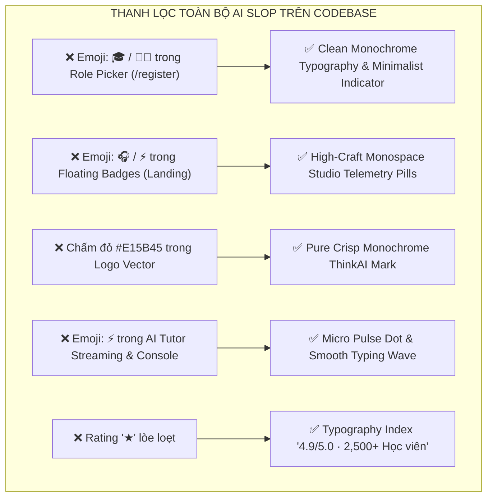

# Kế Hoạch Cải Thiện UI/UX Chuẩn Anti-AI Slop (Dựa trên Taste-Skill & TasteSkill.dev)

## 1. Mục tiêu (Goal Description)
Triệt tiêu toàn bộ các dấu hiệu của **"AI Slop"** (giao diện rập khuôn, lạm dụng emoji sặc sỡ như 🎓, 👨‍🏫, 🎧, ⚡, 🎯, các viền gradient màu mè ngẫu nhiên, icon lòe loẹt thiếu thẩm mỹ) trên toàn bộ codebase ThinkAI.
Áp dụng các nguyên tắc cốt lõi từ **Leonxlnx/taste-skill** & **tasteskill.dev**:
- **Zero Emoji Clutter**: Xóa bỏ toàn bộ emoji trang trí trong nút bấm, role selector, floating badges, chat stream indicator. Thay thế bằng Typography phân cấp cao và SVG Line Icons siêu mảnh (stroke 1.25 - 1.5px).
- **Monochrome & High-Contrast Restraint**:
  - Không phối màu đa sắc ngẫu nhiên.
  - Bảng màu chủ đạo: Pure Black `#000000`, Obsidian `#0D0D11`, Muted Silver `#8E8E93`, Pure White `#FFFFFF`.
  - Giữ duy nhất 1 accent tinh tế, loại bỏ các chấm màu đỏ/cam lạc quẻ.
- **Bespoke Vector Iconography & Clean HUD**:
  - Logo ThinkAI: Tinh giản thành biểu tượng vector tối giản, đơn sắc.
  - Floating Badges trên Landing: Chuyển thành Monospace Telemetry Pills chuẩn studio (`[AUDIO ENGINE] · US / UK / AUS`, `[GRAMMAR CRITIC] · 12ms Latency`).
  - Role Picker trong Đăng ký: Thẻ chọn tối giản dạng pill kính mờ không icon emoji.
- **Typographic Craft**:
  - Tận dụng triệt để font Inter & Geist/Bubbledot với tracking và line-height chuẩn mực, không bao giờ bị cắt descender.

---

## 2. Danh Sách Các Điểm "AI Slop" Cần Thanh Lọc Toàn Diện

---

## 3. Chi Tiết Các File Cần Thay Đổi

### A. Trang Chủ (`app/page.tsx` & `page.module.css`)
- **Logo**: Xóa chấm màu đỏ `#E15B45`, đồng bộ sang vector trắng đơn sắc tối giản.
- **Floating Telemetry**: Xóa `🎧` và `⚡`. Chuyển sang dạng thẻ telemetry đo đạc thời gian thực với micro-dot trắng phát sáng:
  - `• AUDIO ENGINE · US / UK / AUS`
  - `• SEMANTIC CRITIC · 12ms LATENCY`
- **Trust Row**: Thay `4.9 ★` bằng `4.9/5.0 · 2,500+ Học viên TOEIC & IELTS Tin Dùng`.

### B. Phân Hệ Xác Thực (`app/(auth)/register/page.tsx`, `login/page.tsx`)
- **Role Selection**: Xóa `🎓` và `👨‍🏫`, chỉ giữ nhãn text cô đọng:
  - `Tôi là Học viên`
  - `Tôi là Giảng viên`
- **Logo & Inputs**: Đồng bộ icon đơn sắc và viền hairline siêu mảnh.

### C. AI Tutor & Visual Components
- `components/ai-tutor/AiTutorFloatingLauncher.tsx`: Xóa `⚡ Đang xử lý...`, thay bằng `Đang phân tích...` với hiệu ứng sóng âm thanh đơn sắc.
- `components/visuals/AgentConsoleWorkspace.tsx`: Xóa `⚡`, chuẩn hóa typography.

---

## 4. Proposed Changes Summary

| File | Hành động | Mục đích |
|---|---|---|
| `app/page.tsx` | [MODIFY] | Xóa emoji, đổi telemetry pill sang studio monospace, chuẩn hóa logo đơn sắc |
| `app/page.module.css` | [MODIFY] | Tinh chỉnh style floating telemetry pill chuẩn taste-skill |
| `app/(auth)/register/page.tsx` | [MODIFY] | Xóa emoji trong role pills |
| `app/(auth)/login/page.tsx` | [MODIFY] | Chuẩn hóa logo đơn sắc |
| `components/ai-tutor/AiTutorFloatingLauncher.tsx` | [MODIFY] | Xóa emoji trong indicator |
| `components/visuals/AgentConsoleWorkspace.tsx` | [MODIFY] | Xóa emoji trong test query button |

---

## 5. Verification Plan

### Automated Tests
- Chạy `npm run build` để kiểm tra compile sạch sẽ 100%.

### Manual Verification
- Chụp ảnh màn hình đối chiếu Landing page, Login page, Register page để xác nhận không còn bất kỳ emoji/icon màu mè slop nào, đảm bảo giao diện toát lên vẻ sang trọng, tinh tế đúng chuẩn **Anti-AI Slop**.
