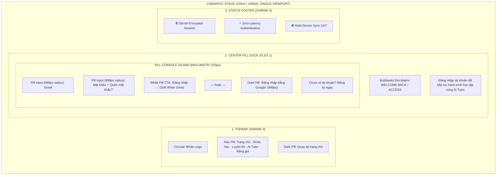

# Kế Hoạch Đồng Bộ Hóa Đột Phá: Chuyển Đổi Box Đăng Nhập Thành Cinematic Pill Stage (100% Đồng Nhất Bố Cục Trang Chủ)

## 1. Vấn đề Hiện Tại (Problem Statement)
- Box đăng nhập/đăng ký hiện tại là một **hình khối chữ nhật đóng khung (`border-radius: 28px`) cục mịch**, nằm trơ trọi giữa màn hình.
- Trong khi đó, toàn bộ ngôn ngữ thiết kế của trang chủ ThinkAI là **Hệ thống Viên nang Tinh xảo (Pill Architecture)**: Header Nav Pill trắng, Trust Pill, CTA Pill phát sáng, và Footer 4 cột viễn trắc.
- Việc đặt một chiếc hộp vuông ở giữa làm gãy hoàn toàn tính liền mạch và cảm giác điện ảnh của nền tảng.

---

## 2. Giải Pháp Thiết Kế Mới (Cinematic Pill Stage Architecture)
Đồng bộ hóa 100% cấu trúc 3 tầng (**Top Header -> Center Interaction Pill Island -> Bottom Metrics**) cho `/login`, `/register`, `/forgot-password`:

---

## 3. Các Chi Tiết Tinh Chỉnh Cụ Thể

### A. Loại Bỏ Chiếc Hộp Vuông Cục Mịch
- Xóa bỏ khối card hình chữ nhật `authIsland`.
- Form hòa nhập trực tiếp vào dòng chảy trang web như một **Interaction Dock** cao cấp, thoáng đãng, lơ lửng trên nền video với hiệu ứng mờ kính siêu nhẹ.

### B. Chuẩn Hóa 100% Sang Hệ Thống Viên Nang (Pill-Based Design System)
- **Tất cả các ô Input**: Bo tròn tuyệt đối (`border-radius: 999px`), padding chuẩn `14px 22px`, viền hairline siêu mỏng `rgba(255, 255, 255, 0.16)` phát sáng viền trắng khi focus.
- **Nút CTA `Đăng nhập →`**: White Pill phát sáng đa tầng (`0 0 22px rgba(255,255,255,0.32)`).
- **Nút Google**: Dark Pill bo tròn `999px` màu `#28282a`.
- **Bộ chọn Role (Đăng ký)**: 2 nút Pill song song `Tôi là Học viên` | `Tôi là Giảng viên`.

### C. Giữ Trọn Bố Cục 3 Tầng & Typography Điểm Ma Trận (Bubbledot)
- Tiêu đề sử dụng font điểm ma trận **Bubbledot**: `Welcome Back` / `Create Account`.
- Header trên cùng và Footer bảo mật dưới cùng giúp trang đăng nhập đạt độ cân bằng thị giác hoàn hảo như trang chủ.

---

## 4. Proposed Changes Summary

| File | Hành động | Mục đích |
|---|---|---|
| `app/(auth)/login/page.tsx` | [OVERWRITE] | Chuyển sang bố cục 3 tầng Single-Viewport với Pill Console |
| `app/(auth)/login/page.module.css` | [OVERWRITE] | Xóa bỏ box vuông, áp dụng 100% Pill-based styling |
| `app/(auth)/register/page.tsx` | [OVERWRITE] | Đồng bộ trang đăng ký sang Pill Stage |
| `app/(auth)/register/page.module.css` | [OVERWRITE] | Pill-based CSS cho đăng ký |
| `app/(auth)/forgot-password/page.tsx` | [OVERWRITE] | Đồng bộ trang quên mật khẩu |

---

## 5. Verification Plan

### Automated Tests
- Chạy `npm run build` xác nhận 0 lỗi.

### Manual Verification
- Chụp ảnh màn hình kiểm thử `/login` và `/register` để đảm bảo:
  1. Chiếc box vuông cục mịch đã biến mất hoàn toàn.
  2. Bố cục đồng bộ 100% với trang chủ (Top Header, Center Pill Console, Bottom Security Metrics).
  3. Tất cả các input, nút bấm, role selector đều theo đúng chuẩn viên nang (Pill Design System).
